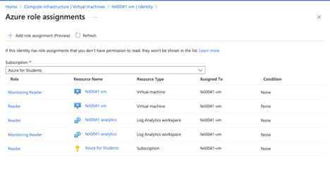

# CST8919 Lab 3 - Grafana

## Introduction
This lab successfully installed and configured Grafana on Ubuntu and integrated it with Azure Monitor using Managed Identity authentication, and visualized virtual machine performance metrics in a custom dashboard.

## Summary
1.	Installed Grafana on Ubuntu and started the service.
2.	Enabled Managed Identity Authentication in Grafana.
3.	Assigned necessary Roles (Monitoring Reader, Reader) to the VM’s Managed Identity.
4.	Configured Azure Monitor as a data source in Grafana.
5.	Created a Grafana dashboard displaying key performance metrics.

## Issues Encountered and Solutions
Grafana was unable to detect resources in Azure Monitor due to missing Azure role assignments for the Managed Identity beacuse I was applying the roles incorrectly. To resolve this, the required Monitoring Reader and Reader roles were assigned properly, allowing Grafana to successfully detect resources for monitoring.

## Steps covered in lab

### Task 1: Preparing the Ubuntu Server

 
### Task 2: Installing Grafana

### Task 3: Connect Grafana to Azure Monitor

### Task 4: Create a Dashboard in Grafana
 

